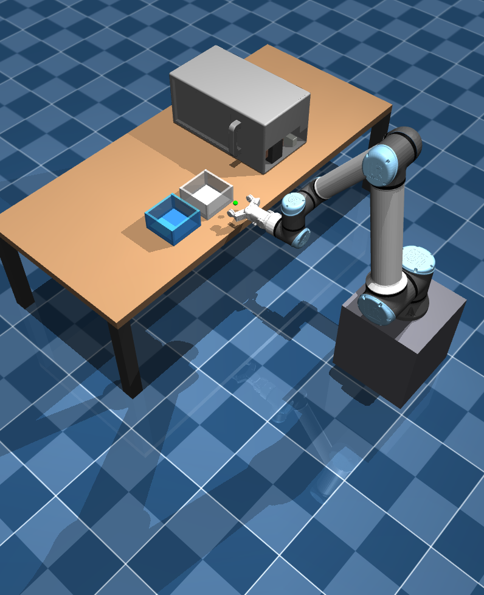

# Diffusion Model - MuJoCo Simulation & ROS2 Deployment

This repository implements a **Diffusion Policy** model tailored for robotic control, developed as part of an internship at LIRMM. The system is designed for both simulation (MuJoCo) and real-world deployment (via ROS2) of a UR10e robotic arm with a gripper, focusing on complex manipulation tasks such as e-waste sorting.

## Demonstrations

### Environment Overview


*MuJoCo simulation environment representing the e-waste sorting setup.*

### Trajectory / Policy Execution
<video src="diffusion_policy/media/deployment_simu.mp4" controls="controls" muted="muted" playsinline="playsinline" width="100%">
  Your browser does not support the video tag.
</video>
*Diffusion model deployment on a microwave disassembly task: grabbing two objects out of a cavity and placing them into their respective sorting boxes.*

## Project Architecture

- **`configs/`**: Hydra configuration files for training and environment setups (e.g., `e_waste_image.yaml`).
- **`data/`**: Directory for training datasets (`.zarr` files), network checkpoints (`u_net_model.ckpt`), and logs.
- **`diffusion_policy/`**: Main source code for the diffusion policy implementation (action generation, neural networks architectures, etc.).
- **`mujoco/`**: Simulation environment containing MuJoCo scenes, UR10e URDFs, and scripts for kinematics, safety checks, and teleoperation.
- **`ros2_WS/`**: ROS2 workspace for real-robot control (includes hardware drivers like `touch_ros2_driver`).
- **`scripts/`**: Utility scripts (e.g., `traj_zarr.py` for 3D trajectory replay, `check_zarr.py`, metrics plotting, etc.).

## Installation & Prerequisites

A detailed guide for setting up the environment can be found in [README_ENV.md](README_ENV.md).

Quick Conda installation summary:
```bash
conda env create -f environment_sim.yml
conda activate <your_env_name>
pip install -r requirements_sim.txt
```

## Usage

### 1. Teleoperation and Data Collection
Teleoperation scripts are available in `mujoco/teleop/` locally to generate your own demonstration datasets.

### 2. Dataset Validation
Visualize the 3D trajectories of your collected `.zarr` datasets to ensure they are smooth and valid before triggering the training:
```bash
python scripts/traj_zarr.py --pos-key "robot_pos"
```

### 3. Training 
Launch the training process natively from the diffusion module using the main configuration file:
```bash
python diffusion_policy/train.py --config-name=train_e_waste.yaml
```

### 4. General Launch
You can use the provided bash script to run the main pipeline operations:
```bash
bash launch_all.sh
```
